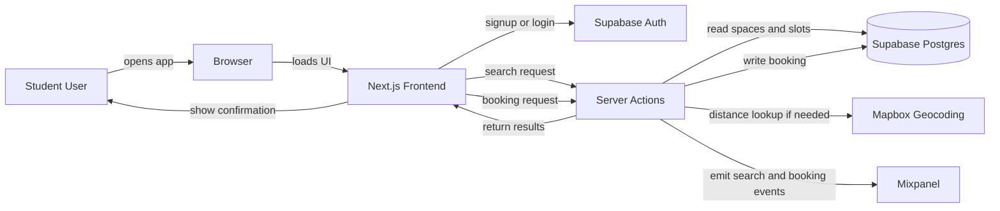

# Example Architecture Diagram Notes

**Team:** StudySpace Finders  
**Product:** StudySpace

This file shows one way to plan `architecture-diagram.png` before export.

---

## Diagram Goal

This diagram shows how a student moves through the Sprint 1 booking flow from client request to confirmed booking.

---

## Mermaid Source Example



---

## What the Final PNG Should Emphasise

- user enters on the left
- frontend and server are distinct
- auth is shown before sensitive actions
- search and booking both touch the database through server logic
- analytics fires on key actions
- external API is shown as optional support, not the system center

---

## AI Annotation for the Diagram

Add a small note near the diagram margin:

```text
AI in Sprint 1 runtime: none
AI in build workflow: Stitch for UI scaffolding, Claude Code for server logic review support, Copilot for inline completion
```

This keeps architecture and tool governance aligned.
