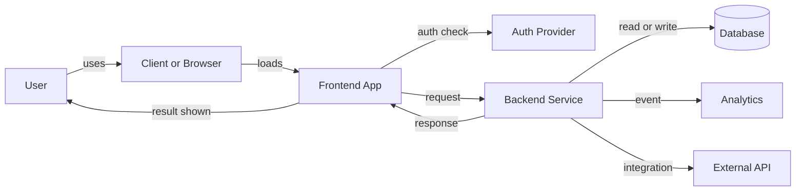

# Architecture Diagram Template

**Final required file:** `03-build/architecture/architecture-diagram.png`

Use this file to plan the diagram before exporting the PNG.

---

## 1. Diagram Goal

Write one sentence.

```text
This diagram shows how [user] moves through [core request] across the Sprint 1 system.
```

---

## 2. Required Boxes

Your final diagram should usually include these boxes:

- User
- Browser or client app
- Frontend application
- Authentication provider
- Backend or server logic
- Database
- Analytics or event tracking
- External APIs or services
- AI touchpoints, if they exist

If one is not needed, say why.

---

## 3. Required Arrows

Your arrows should answer these questions:

- What request leaves the browser?
- Where is auth checked?
- What is read from or written to the database?
- When does analytics fire?
- What comes back to the user?

Label arrows with action words such as:

- submits
- validates
- reads
- writes
- emits event
- returns result

---

## 4. Mermaid Starter, Optional

You may sketch the diagram in Mermaid before exporting a final PNG.



---

## 5. AI Annotation Rules

If AI exists in the product or team workflow, annotate one of these clearly:

- AI in product runtime
- AI in development workflow only
- No AI in Sprint 1 product runtime

Do not leave this implied.

---

## 6. Final Export Check

- [ ] Boxes match the written system design
- [ ] Arrows are labeled
- [ ] Database is visually distinct
- [ ] Auth is shown where it happens
- [ ] Analytics is shown where events fire
- [ ] Diagram is readable at normal zoom
- [ ] PNG exported and committed
