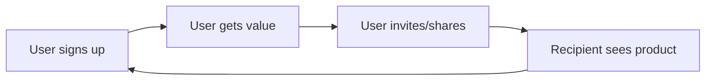

# Loops and Moats Narrative

**Team:** [Team name]
**Product:** [Product name]
**Document version:** 1.0
**Last updated:** [Date]

---

## 1. Viral Loop Analysis

### Does your product have a viral loop?

**Answer:** Yes / No / Partial

[If yes, describe in 2-3 sentences. If no, say so honestly.]

### If yes -- Loop Diagram

```
[User signs up] → [User gets value] → [User invites or shares] → [New user signs up] → loop
```

Or use Mermaid:



### K-Factor Calculation

```
K = invitations sent per user × conversion rate of invitations
```

**Invitations per user (i):** [number]
- Source: [How you got this. Estimate from product mechanics, observation, A/B test result.]

**Conversion rate of invitations (c):** [%]
- Source: [How you got this.]

**K-factor:** K = [i] × [c] = [result]

### Interpretation

| K value | Meaning |
|---------|---------|
| K < 1 | Loop reduces effective CAC but does not generate compounding growth on its own |
| K = 1 | Steady-state replacement; loop sustains user count |
| K > 1 | Compounding viral growth |

**Our K is [value], which means:** [Two sentences on what this implies for your strategy.]

### If no loop yet

**Why not:** [E.g., "Single-player product, no inherent reason to share."]

**Could one be added?** [E.g., "Yes, by adding a 'share session' feature." Or "No, the use case is inherently solitary."]

---

## 2. Network Effects Analysis

### Does your product have network effects?

**Answer:** Yes / No / Weak

### If yes -- What type?

Pick one (or more if applicable):

- **Direct:** Users get value from other users on the same product. (Examples: WhatsApp, LinkedIn)
- **Two-sided:** Two distinct user groups need each other. (Examples: Uber, Airbnb)
- **Data:** Each user contributes data that improves the product for the next user. (Examples: Waze, Spotify)
- **Local:** Network only matters within a small geography or community. (Examples: Slack within a company, Nextdoor)

**Our type:** [Pick one]

**Why this type fits:** [2-3 sentences]

### Threshold

At what point do network effects become noticeable to a user?

**Critical mass:** [Number of users, or other threshold]

**Reasoning:** [Why is that the threshold? What changes at that point?]

**Example:** "Critical mass is 50 active KIU CS students. Below that, a student opening the app may not see any active study sessions and bounces. At 50+, there is always at least one active session, which makes the product useful."

### Strategy to reach the threshold

[How will you concentrate early users so the threshold is hit in one segment, rather than diluted across many?]

---

## 3. Defensibility Analysis

What protects you against a copycat with 10x your resources?

### Possible moats

- **Brand:** Users recognise and prefer your product. [Strong / Weak / None for us]
- **Data:** You have proprietary data that makes the product better. [Strong / Weak / None]
- **Switching costs:** Once a user is on your product, leaving is costly. [Strong / Weak / None]
- **Network effects:** See section 2. [Strong / Weak / None]
- **Distribution lock-in:** You own a channel competitors cannot access. [Strong / Weak / None]
- **Regulatory:** Compliance or licensing barriers. [Strong / Weak / None]
- **Speed of iteration:** You move faster than larger competitors can. [Strong / Weak / None]

### Our actual moat (today)

[Be honest. Most early-stage products have no real moat. The honest answer is often "speed and focus, while we work toward [target moat]."]

### Our planned moat (12 months out)

[What are you actively building toward? Data accumulation? Network density? Brand?]

---

## 4. Riskiest Assumption

If you had to bet your team's grade on one number being wrong, which one would you pick, and why?

**Riskiest assumption:** [Name it]

**Current value in our model:** [Number]

**Why it is the riskiest:** [2-3 sentences. What would happen if it were 2x worse?]

**How we will validate it in Sprint 2:** [Concrete action with date]

---

## 5. Summary Statement

In 3-4 sentences, summarise your growth and defensibility story. This is the version you would tell an investor in 30 seconds.

[Your statement here.]

**Example for StudySpace Finders:** "We acquire users via Reddit and university Discord servers, where our target audience already gathers. Our K-factor is 0.3 because solo users sometimes invite study partners; this halves our effective CAC. We have local network effects within KIU: once 50 active users in one university, the product becomes self-sustaining there. Our riskiest assumption is the 0.3 K-factor; we will measure it directly in Sprint 2 and adjust accordingly."

---

**Filed by:** [Names]
