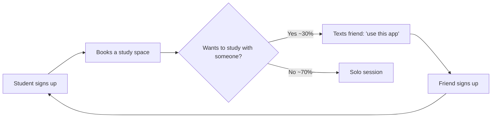

# Loops and Moats Narrative -- StudySpace Finders

**Team:** StudySpace Finders
**Product:** Real-time campus study space finder
**Document version:** 1.0
**Last updated:** 7 May 2026

---

## 1. Viral Loop Analysis

### Does your product have a viral loop?

**Answer:** Partial. There is a weak loop because users sometimes invite a study partner so they can sit together. There is no formal in-product invite mechanism yet.

### Loop Diagram



The loop exists outside the product (in WhatsApp messages between friends) rather than inside it. Adding an in-product "share session" feature would tighten and likely strengthen the loop.

### K-Factor Calculation

```
K = invitations sent per user × conversion rate of invitations
```

**Invitations per user (i):** 0.7

Source: Of our 12 user interviews, 4 said they "would tell a friend" and 8 said they "might tell one or two specific friends." We estimate roughly 0.7 informal invites per activated user in the first 30 days. This will be measured properly in Sprint 2 by tracking signups that mention being referred.

**Conversion rate of invitations (c):** 40%

Source: When a friend recommends an app for a real and immediate need, conversion is high. Industry estimates for friend-to-friend recommendations of utility apps range from 30 to 50%. We use 40%.

**K-factor:** K = 0.7 × 0.4 = **0.28**

### Interpretation

| K value | Meaning |
|---------|---------|
| K < 1 | Loop reduces effective CAC but does not generate compounding growth on its own |

Our K is **0.28**, which means our loop reduces effective CAC by ~28%. If our paid CAC is $1.00, our effective CAC becomes about $0.78. Useful but not transformational.

The loop is not strong enough to drive growth on its own. It supplements paid and organic channels rather than replacing them. We could likely raise K to 0.5 by adding a "share to study together" feature in the booking flow, where the user picks a friend's name and the app messages them with the booking details and a link.

---

## 2. Network Effects Analysis

### Does your product have network effects?

**Answer:** Yes, **local** network effects.

### Type: Local

**Why this type fits:** The product is only useful within KIU. A student at another university gets no value from us. A student at KIU benefits enormously when other KIU students are also on the app, because:
1. The system can show real-time occupancy data only if users are checking in (more users = better data).
2. Booked study spots show as taken to other users (more users = more accurate availability).
3. Future "study together" features depend on having other users in the same building at the same time.

### Threshold

**Critical mass:** 50 active users in a single semester at KIU.

**Reasoning:** Below 50 active users, the real-time occupancy data is too sparse to be useful (a student opens the app and sees mostly "unknown" status next to study spaces). Above 50, there is enough check-in data that most spaces show as occupied or free with reasonable confidence. 50 users represents about 16% of the 312 enrolled CS students.

### Strategy to reach the threshold

We are concentrating early acquisition entirely on KIU CS students (not other departments, not other universities). This is intentional. Spreading across multiple universities would dilute the network and delay critical mass everywhere. We win KIU CS first, then expand to other KIU departments, then to other universities.

This is the same strategy Slack used (one company at a time) and Nextdoor used (one neighborhood at a time).

---

## 3. Defensibility Analysis

### Possible moats

- **Brand:** Currently weak. We are a student project. [Weak for us]
- **Data:** Strong potential. The occupancy data accumulates and gets more valuable. [Medium]
- **Switching costs:** Low. A user can switch to any alternative. [Weak]
- **Network effects:** Yes, local, see section 2. [Strong]
- **Distribution lock-in:** None. We do not own a channel a competitor cannot access. [None]
- **Regulatory:** None. [None]
- **Speed of iteration:** Strong. As students embedded in the user base, we can iterate faster than an external company. [Medium]

### Our actual moat (today)

Honest answer: we have a head start at KIU, no real moat. A copycat could replicate the product in 2 weeks. What protects us is that they would have to acquire users from scratch in a market where 50 of 312 students are already on our app, and the network effect makes a second app worse than the first.

### Our planned moat (12 months out)

Two moats we are deliberately building:

1. **Network density at KIU.** If we hit 200+ active users at KIU within 6 months, a copycat starting from scratch would face a much worse experience and would not be able to displace us.
2. **Data moat from accumulated occupancy patterns.** With 6 months of historical occupancy data, we can predict (not just report) which spaces will be free at which times. A new entrant has zero history.

---

## 4. Riskiest Assumption

**Riskiest assumption:** That 50 active users in a single semester is sufficient to trigger network effects.

**Current value in our model:** 50 users threshold.

**Why it is the riskiest:** If the actual threshold is higher (e.g., 100 or 150 users), we may build a product that never achieves self-sustaining usage and needs continuous acquisition spending. If the threshold is lower (e.g., 25 users), we hit critical mass earlier and can shift effort to other things sooner.

**How we will validate it in Sprint 2:** Track product usage as a function of active user count. Plot D7 retention against weekly active user count. Look for the inflection point where retention jumps. That inflection is the real threshold.

---

## 5. Summary Statement

StudySpace Finders acquires users via Reddit, Discord, faculty email, and posters in the CS building. CAC is under $1.50 per user across all channels because our audience is concentrated in one university. Our K-factor is 0.28 (informal word-of-mouth between study partners), which lowers effective CAC by 28%. We have local network effects: at 50 active KIU CS users, the product becomes self-sustaining. Our riskiest assumption is the 50-user network effect threshold; we will measure this directly in Sprint 2 by tracking D7 retention against weekly active user count.

---

**Filed by:** Nino, David, Mariam, Luka
